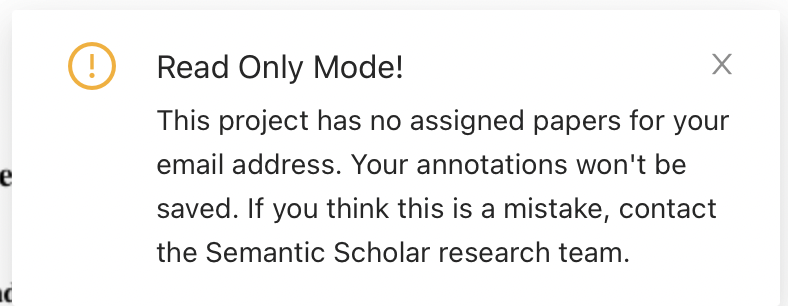

# Paper Skimming: Annotation Guidelines

This document contains the annotation guidelines for the paper skimming project.
If you have been hired to provide annotation services, please read it carefully.
For any question, email us to [paper-skimming-annotations@allenai.org][7],
or get in touch through the hiring platform you signed up with (e.g. UpWork).

## Annotation Guidelines

To help you complete this task, imagine being part of the following scenario.

You have been hired by a scientific communication magazine (for example,
[Communications of the ACM][8] or [MIT Technology Review][9]) to help
**create abridged versions of scientific papers**. These are shorter versions
of full academic papers that are often read by researchers from the same academic
field who might not have time to read full-length manuscript.

Your boss, the editor, has given you a target length of **200 words per paper  page**,
with some wiggle room. For example:

|Length of Paper    | Word count target |
|:-----------------:|:-----------------:|
|4 pages            |  800 ± 40 words   |
|8 pages            |  1,600 ± 80 words |
|12 pages           | 2,400 ± 120 words |

You have to **decide which sentences from the manuscript are significant**, and
thus should be kept while fitting within the target length. Anything you do not
select will be mercilessly thrown away by the ruthless editor. Further, you have
to meet the following conditions when selecting sentences:

1. You can only keep **full sentences**, not fragments.
    - If only a portion of a sentence is significant, also highlight the rest of the sentence.
2. You have to keep **at least 1 sentence for each section heading**.
    - This applies to all section headings with some text underneath it. For example has sections 3, and 3.1, you should keep at least one sentence for each heading: 
    - In case a section has no text underneath, you can skip it; in this example example, Section 3 has no sentences to highlight, so one can move to 3.1 instead:
    
3. You can only **select sentences from the main text**. Leave the title,
abstract, figures, or table captions as they are: the editor has decided
to reproduce them in full (*phew!*)

Try to keep within the target length! This magazine is still printed and
distributed to subscribers, so every drop of ink counts.

Ideally, someone can read the set of chosen sentences like a coherent
document--our editor is lazy, and does not want to rewrite any of the shortened
paper before it is published.

## Workflow

### Step 1: Open one of the Papers to Annotate

Use the links in the ["Papers" section](#papers) below to open a paper.

### Step 2: Familiarize Yourself with the Annotation Interface

### Step 3: Highlighting Sentences

To highlight a sentence, hold your mouse down while spanning across the text you want to highlight.

### Step 4: Mark a Paper as Finished When Done

Don't forget to use the toggle to mark a paper as finished as shown in [Step 2](#step-2-familiarize-yourself-with-the-annotation-interface).

## Goal

We are looking at ways to improve first-time reading experience of PDFs;
in particular, we want to create a system that highlights important passages in papers.
The data you annotate will help us power this new system.

Here's an example of a potential interface for this system:

Highlighted passages could contain key background information, contribution statements, important results, and so on.

## Papers

The following papers have been chosen for you for the first round of annotations.

- [Short Paper 1][6] (5 pages) Target: **1,000** ± 50 words.
- [Long Paper 1][1] (8 pages) Target: **1,600** ± 80 words.
- [Long Paper 2][2] (8 pages) Target: **1,600** ± 80 words.
- [Long Paper 3][3] (8 pages) Target: **1,600** ± 80 words.
- [Long Paper 4][4] (8 pages) Target: **1,600** ± 80 words.
- [Long Paper 5][5] (8 pages) Target: **1,600** ± 80 words.

If you get a read only note like the one shown below, it means the paper hasn't
been assigned to you yet. If we did tell you otherwise, please send us a message
at [paper-skimming-annotations@allenai.org][7]. If we haven't confirmed yet that
the a paper has been assigned to you, please wait a little while.

[1]: https://pawls.skimming-annotations.apps.allenai.org/pdf/07fe8482df88405b718fe77db2f46e51fee4aed512dc7179aae3c70804ae0e8a
[2]: https://pawls.skimming-annotations.apps.allenai.org/pdf/056002826389e5c8222071117b2c5a358fcbfd72536d7d87ed6ab5f5b8afaa32
[3]: https://pawls.skimming-annotations.apps.allenai.org/pdf/4f276356d2b1a8acd7d6c2d583abf23356a833428624f8ff12d9e57371ac8300
[4]: https://pawls.skimming-annotations.apps.allenai.org/pdf/b15b4378988ed4e553dd312eaf334411abcf1fb28c53b846d360435eb55cd193
[5]: https://pawls.skimming-annotations.apps.allenai.org/pdf/416b17a3fa07da8c811381144c0e042bbfecd2df3a5028ecf03fb5735d7309a8
[6]: https://pawls.skimming-annotations.apps.allenai.org/pdf/9c420ad8eb59c3a5361c45073f799ea52933029b346b430bfe2002744f9cfdef
[7]: mailto:paper-skimming-annotations@allenai.org
[8]: https://cacm.acm.org
[9]: https://www.technologyreview.com
